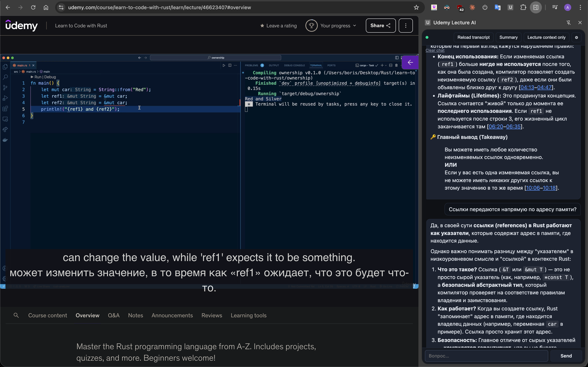

# Udemy Lecture AI Assistant

Chrome extension for working with Udemy lectures via an LLM — either a local OpenAI-compatible endpoint (LM Studio, llama.cpp, Ollama) or the OpenAI Cloud API. It extracts the transcript of the current lecture, summarizes it, and answers questions about it — or works as a plain chat when no transcript is loaded.



## Features

### Transcript
- Pulls the transcript via the official Udemy API (`/api-2.0/.../lectures/.../?fields[asset]=captions`) — does not depend on whether the on-page transcript panel is open.
- Defaults to manual English captions; falls back to any English track, then manual, then the first available.
- Automatically reloads the transcript on SPA navigation between lectures (via `chrome.webNavigation.onHistoryStateUpdated`).
- If the content script has not been injected into the tab yet, the side panel injects it on demand via `chrome.scripting.executeScript`.
- DOM fallback that scrapes the on-page transcript panel if the API path fails.

### LLM providers
- **Local LLM** — any OpenAI-compatible endpoint (defaults to LM Studio at `http://127.0.0.1:1234/v1`). Model list is pulled from `/v1/models`.
- **OpenAI Cloud** — API key stored in `chrome.storage.local`. The model dropdown is populated live from `/v1/models` filtered to chat-capable families.
- Provider is switched with a radio in the Model tab; each provider has its own settings form and its own **Test** button that pings `/v1/models` and reports the result inline.
- `reasoning_effort` is set automatically per OpenAI model family — `none` for `gpt-5.1+`, `low` for `gpt-5`/`o1`/`o3`/`o4`, and omitted for `gpt-4o`/`chatgpt-*` (which reject the parameter).

### Chat
- Streaming responses: tokens appear as they are generated (SSE, just like ChatGPT). Requests go **directly** from the side panel to the LLM, not through the service worker.
- The **Send** button turns into a **Stop** button while a reply is streaming, so you can abort a long answer at any point. Whatever was already generated stays in the chat history.
- Assistant replies are rendered as Markdown via vendored `marked.js` (GFM: tables, code, lists, etc.).
- **Syntax highlighting** for fenced code blocks via vendored `highlight.js` with the GitHub Dark theme.
- **Clickable timestamps**: when the model writes `[mm:ss]` or `[hh:mm:ss]` — including ranges like `[00:11, 00:20]` or `[01:23 - 01:30]` — each timestamp becomes a link that seeks the Udemy player to that moment. Works even on DRM-protected videos because it only sets `video.currentTime`, no pixel access required.
- **Use lecture context only** toggle (on by default) — strict mode, answers come only from the transcript. Turn it off to ask general questions that the model answers from its own knowledge.
- Free chat works even without a loaded transcript.

### Summaries
- **Summarize it** — top-bar button, uses the `summaryPrompt` from settings (defaults to a free-form Russian summary). Skips chat history so the KV cache stays hot.
- **Summary with examples** — menu item, uses the `summaryExamplesPrompt` and asks the model to add a short runnable example for every key concept in the language the lecture is about.
- Both commands auto-load the transcript if it is missing.

### Settings (⛭ in the top-right corner)
Three tabs:
- **Model** — provider radio (Local / OpenAI Cloud) and the corresponding form. Each form has its own **Save** button.
- **Prompts** — editable `Summarize it` and `Summary with examples` templates with **Reset to defaults** and per-form **Save**.
- **UI** — UI font size, chat font size, and a toggle for a transparent background for assistant messages.

### UX
- **Per-tab side panel**: the panel is scoped to the tab where you opened it. Switch to another tab — it hides. Come back — it reappears with state preserved (same approach as Claude for Chrome).
- **Connection status** indicator in the top-left corner: **LLM connected** when `/v1/models` returns at least one model, **LLM offline** otherwise.
- **Clear chat history** in the ▾ menu — wipes the conversation (and the model context) without touching the loaded transcript.

## Installation

1. Clone this repository.
2. Open `chrome://extensions/` and enable **Developer mode** (top-right corner).
3. Click **Load unpacked** and select the extension folder.
4. **Local LLM path**: launch [LM Studio](https://lmstudio.ai) and start the local server (**Developer → Start Server**). By default it listens on `127.0.0.1:1234`. Load any model.
5. **OpenAI Cloud path**: open settings → Model → pick **OpenAI Cloud**, paste your API key, hit **Test**, pick a model, **Save**.

## Usage

1. Open a Udemy lecture: `https://www.udemy.com/course/.../learn/lecture/...`.
2. Click the extension icon in the Chrome toolbar — the side panel opens on the right, scoped to that tab.
3. Press **Reload lecture transcript** — the extension pulls all cues via the API. Switching to another lecture reloads it automatically.
4. Type any question in the composer at the bottom. **Enter** sends, **Alt/Shift+Enter** inserts a newline. The textarea grows up to three lines.
5. Use **Summarize it** in the top bar for a free-form summary, or the **▾ menu → Summary with examples** to additionally get runnable code snippets.
6. Use the **Use lecture context only** chip below the composer to toggle strict mode.
7. While a reply is streaming, the **Send** button becomes a **Stop** button — click it to abort. Whatever was already streamed stays in the chat history.
8. Click any `[mm:ss]` timestamp in an assistant reply to jump the Udemy player to that moment.

## Project layout

```
.
├── manifest.json            # MV3 manifest
├── background.js            # service worker: per-tab side panel wiring only
├── content.js               # reads courseId/lectureId, hits captions API, parses VTT
├── sidepanel.html           # side panel UI (tabs: Model / Prompts / UI)
├── sidepanel.css            # dark theme, CSS variables for fonts
├── sidepanel.js             # thin orchestrator: init + event wiring
├── src/
│   ├── defaults.js          # DEFAULTS + default prompts + OpenAI base URL
│   ├── settings.js          # chrome.storage.local wrapper (load/patch)
│   ├── providers.js         # local + openai provider objects, streamChat, testEndpoint
│   ├── transcript.js        # getActiveUdemyTab, sendToTab, buildSystemPrompt
│   ├── markdown.js          # marked + hljs config, timestamp linkifier
│   └── ui.js                # els, addMsg, setStatus, setBusy, font/appearance
└── vendor/
    ├── marked.min.js                  # markdown → HTML (MIT)
    ├── highlight.min.js               # syntax highlighting (BSD-3-Clause)
    └── highlight-github-dark.min.css  # code theme
```

`sidepanel.js` is loaded as an ES module (`<script type="module">`) and imports from `src/`. `marked` and `hljs` are classic scripts loaded before it so they are available as globals when the modules execute.

## How the transcript is fetched

1. The page `/course/{slug}/learn/lecture/{id}` exposes an element with a `data-module-args` attribute whose JSON payload contains `courseId`.
2. `lectureId` is read from the URL (`/lecture/{id}`) so it stays fresh across SPA transitions. `initialCurriculumItemId` from `data-module-args` is only used as a fallback.
3. The content script calls:
   ```
   GET /api-2.0/users/me/subscribed-courses/{courseId}/lectures/{lectureId}/?fields[asset]=captions
   ```
   (the user's cookies are sent automatically via `credentials: 'include'`).
4. The response contains a `captions` array with signed VTT URLs for every available language.
5. Manual English is selected → VTT is downloaded → parsed into `{start, end, text}[]`.
6. The timestamped text is injected into the LLM system prompt.

## How the chat works

Requests to the LLM (`/v1/chat/completions` with `stream: true`) are made **directly** from the side panel (host_permissions cover `127.0.0.1`, `localhost`, and `api.openai.com`), bypassing the service worker. The response is read via `ReadableStream.getReader()`, SSE lines (`data: {...}`) are parsed, and `choices[0].delta.content` is accumulated — the assistant bubble is re-rendered through `marked.parse()` on every chunk.

Each request contains:

- **system**: instructions plus the optional timestamped transcript.
- **history**: previous user/assistant pairs from the current session (skipped for the two summary commands so the KV cache stays hot).
- **user**: the new message.

The chat history lives in memory inside the side panel and is **preserved** when switching between lectures — only the transcript in the system prompt changes. It is cleared when the panel is closed.

## Why it's fine to resend the transcript on every call

LLM APIs are completely stateless. What we call "chat history" is just the `messages` array that the client sends on every request. There is no server-side memory, neither in LM Studio nor in OpenAI.

LM Studio (llama.cpp under the hood) does **prompt prefix caching** on the KV cache: if the prefix of the messages is identical to the previous request — and the system prompt with the transcript does not change between questions about the same lecture — the model does not recompute those tokens. So the second and subsequent questions hit the prompt-eval stage almost instantly; only the generated tokens add latency.

The cache is invalidated when the transcript changes (e.g. switching lectures) or when you toggle strict mode, at which point llama.cpp recomputes from the point where the prefix diverges.

## Known limitations

- The side panel does not survive being closed — the chat history is lost.
- Long lectures (>80k tokens) may not fit into the model context — chunking is not implemented.
- The content script is injected automatically on SPA navigation, but already-open tabs need a reload the first time the extension is installed — this is standard Chrome behavior.

## License

MIT
