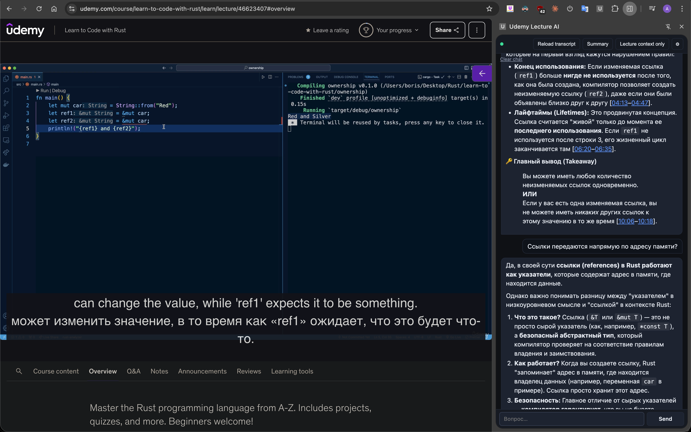

# Udemy Lecture AI Assistant

Chrome extension for working with Udemy lectures via an LLM — a local OpenAI-compatible endpoint (LM Studio, llama.cpp, Ollama), the OpenAI Cloud API, or any of the 300+ models on OpenRouter (Claude, Gemini, Llama, Mistral, Qwen, DeepSeek, etc.). It extracts the transcript of the current lecture, summarizes it, and answers questions about it — or works as a plain chat when no transcript is loaded.

Chat history, transcripts, and summaries are persisted to an optional local memory backend, so you can return to any lecture later and continue the conversation where you left off — like reopening an old ChatGPT thread.



## Features

### Transcript
- Pulls the transcript via the official Udemy API (`/api-2.0/.../lectures/.../?fields[asset]=captions`) — does not depend on whether the on-page transcript panel is open.
- Defaults to manual English captions; falls back to any English track, then manual, then the first available.
- Automatically reloads the transcript on SPA navigation between lectures (via `chrome.webNavigation.onHistoryStateUpdated`).
- If the content script has not been injected into the tab yet, the side panel injects it on demand via `chrome.scripting.executeScript`.
- DOM fallback that scrapes the on-page transcript panel if the API path fails.

### LLM providers
- **Local LLM** — any OpenAI-compatible endpoint (defaults to LM Studio at `http://127.0.0.1:1234/v1`). Model list is pulled from `/v1/models`.
- **OpenAI Cloud** — API key stored in `chrome.storage.local`. The model dropdown is populated live from `/v1/models` filtered to chat-capable families.
- **OpenRouter** — one API key for 300+ models across all major providers. The model list is pulled from `/models`; above the dropdown there is a **Filter** input — type `claude`, `gpt`, `gemini`, `free`, or any substring of the model id/name, and the list rebuilds instantly. The currently saved model stays pinned at the top as a "(not in filter)" ghost entry even when hidden by the filter so you never lose it.
- Provider is switched with a radio in the Model tab; each provider has its own settings form and its own **Test** button that pings `/v1/models` and reports the result inline.
- `reasoning_effort` is set automatically per OpenAI model family — `none` for `gpt-5.1+`, `low` for `gpt-5`/`o1`/`o3`/`o4`, and omitted for `gpt-4o`/`chatgpt-*` (which reject the parameter).
- For OpenRouter the request always carries `reasoning: { effort: "none" }`, which globally disables thinking for every reasoning-capable model (Claude thinking, DeepSeek R1, Gemini Thinking, GPT-5, etc.) so you get straight answers without the chain-of-thought overhead.

### Chat
- Streaming responses: tokens appear as they are generated (SSE, just like ChatGPT). Requests go **directly** from the side panel to the LLM, not through the service worker.
- The **Send** button turns into a **Stop** button while a reply is streaming, so you can abort a long answer at any point. Whatever was already generated stays in the chat history.
- Assistant replies are rendered as Markdown via vendored `marked.js` (GFM: tables, code, lists, etc.).
- **Syntax highlighting** for fenced code blocks via vendored `highlight.js` with the GitHub Dark theme.
- **Clickable timestamps**: when the model writes `[mm:ss]` or `[hh:mm:ss]` — including ranges like `[00:11, 00:20]` or `[01:23 - 01:30]` — each timestamp becomes a link that seeks the Udemy player to that moment. Works even on DRM-protected videos because it only sets `video.currentTime`, no pixel access required.
- **Use lecture context only** toggle (on by default) — strict mode, answers come only from the transcript. Turn it off to ask general questions that the model answers from its own knowledge.
- Free chat works even without a loaded transcript.

### Summaries
- **Summarize it with e.g.** — top-bar button. Uses the `summaryExamplesPrompt` and asks the model to add a short runnable code example for every key concept in the language the lecture is about.
- **Summarize it** — item in the ▾ menu. Uses the free-form `summaryPrompt`.
- Both append the result to the chat as a regular assistant message and persist it to the memory backend as a `/history` row with `is_summary: true`. Re-running either button appends a fresh summary; the backend keeps every revision tied to its `created_at`.

### Memory backend (optional)
- A separate local service (default URL: `http://localhost:8088`) keyed by `(course_id, lecture_id)`. The extension only talks to it via `GET`/`POST`/`PUT`/`PATCH` — there are no DELETE calls anywhere in the client.
- Per-lecture data is split between two endpoints:
  - `/lections` holds the lecture row: `course_id`, `lecture_id`, `title`, `url`, `transcript`.
  - `/history` holds the chat log: each row is `kind: 'q' | 'a'`, `content`, optional `model`, and `is_summary: boolean`. Summaries are just `a`-rows with `is_summary: true`.
- When you open a lecture (panel init, lecture switch, or **Load memory** click) the extension clears local state and reloads everything for that `(course_id, lecture_id)` from the backend.
- Configure it in the **Memory** settings tab: enable/disable toggle, base URL, and a **Test** button that pings `/healthz`.
- Status of the backend is shown next to the LLM dot in the top-left corner.

### Settings (⛭ in the top-right corner)
Four tabs:
- **Model** — provider radio (Local / OpenAI Cloud / OpenRouter) and the corresponding form. Each form has its own **Save** button.
- **Prompts** — editable `Summarize it` and `Summary with examples` templates with **Reset to defaults** and per-form **Save**.
- **UI** — UI font size, chat font size, and a toggle for a transparent background for assistant messages.
- **Memory** — enable/disable the memory backend, configure its base URL, and test the connection.

### UX
- **Per-tab side panel**: the panel is scoped to the tab where you opened it. Switch to another tab — it hides. Come back — it reappears with state preserved (same approach as Claude for Chrome).
- **Two status indicators** in the top-left corner: the first dot is **LLM connected/offline**, the second is **Memory online/offline/off** (off = disabled in settings).
- **Load memory** in the top bar — clears local state and re-reads the lecture (meta, transcript, history) from the memory backend. Useful after a Clear chat, or to discard any local changes and resync.
- **Reload lecture transcript** in the top bar — force-fetches the transcript from the Udemy page and overwrites the copy in the memory backend. Does not touch the chat.
- **Clear chat history** in the ▾ menu — wipes the conversation (and the model context) **locally only**. The backend is untouched, so reopening the lecture restores everything.

## Installation

1. Clone this repository.
2. Open `chrome://extensions/` and enable **Developer mode** (top-right corner).
3. Click **Load unpacked** and select the extension folder.
4. **Local LLM path**: launch [LM Studio](https://lmstudio.ai) and start the local server (**Developer → Start Server**). By default it listens on `127.0.0.1:1234`. Load any model.
5. **OpenAI Cloud path**: open settings → Model → pick **OpenAI Cloud**, paste your API key, hit **Test**, pick a model, **Save**.
6. **Memory backend (optional)**: run a `learn-memory` server locally (default port `8088`). In settings → Memory, paste the base URL, hit **Test**, **Save**. If you skip this step the extension still works as a stateless chat — opening the same lecture twice will start a fresh conversation.

## Usage

1. Open a Udemy lecture: `https://www.udemy.com/course/.../learn/lecture/...`.
2. Click the extension icon in the Chrome toolbar — the side panel opens on the right, scoped to that tab. If a lecture is already open, the panel auto-loads its transcript and chat (from the memory backend, if available).
3. **Switching lectures**: the panel detects the SPA navigation and reloads everything for the new lecture from memory.
4. **Reload lecture transcript** forces a fresh fetch from Udemy and overwrites the saved transcript. Use it when Udemy updates the lecture content.
5. **Load memory** re-reads the lecture (meta, transcript, chat history) from the memory backend. Useful after Clear chat or to discard local-only changes.
6. Type any question in the composer at the bottom. **Enter** sends, **Alt/Shift+Enter** inserts a newline.
7. Use **Summarize it with e.g.** in the top bar for a summary with code examples, or **▾ menu → Summarize it** for a free-form summary. Each press appends a new summary to the chat and to `/history` with `is_summary: true`.
8. Use the **Use lecture context only** chip below the composer to toggle strict mode.
9. While a reply is streaming, the **Send** button becomes a **Stop** button — click it to abort. Whatever was already streamed stays in the chat history.
10. Click any `[mm:ss]` timestamp in an assistant reply to jump the Udemy player to that moment.

## Operating rules (свод правил)

Plain-language summary of how the extension behaves end-to-end:

- **Любое новое сообщение всегда дорисовывается вниз диалога.** Никаких pin-сообщений сверху, никаких якорей.
- **Саммари — это просто очередное сообщение в истории с признаком `is_summary: true`.** В чате выглядит как обычный ответ ассистента.
- **Кнопки суммаризации (две разных).** Каждое нажатие добавляет ещё одно сообщение в чат и в memory как `POST /history { kind: 'a', is_summary: true, model }`. На лекцию может быть сколько угодно саммари — это просто записи в истории.
- **Смена лекции.** Стейт расширения чистится. Сообщения и transcript для этой лекции грузятся из memory. Если в memory нет transcript — берётся со страницы Udemy и кладётся в memory.
- **Кнопка «Reload lecture transcript».** Принудительно берёт transcript со страницы, кладёт в state расширения и обновляет поле `transcript` соответствующей лекции в memory. Историю чата не трогает.
- **Когда расширение запускается на лекции или меняется лекция** — состояние и LLM-контекст полностью очищаются и заполняются заново из memory.
- **Вопрос пользователя** сохраняется в `/history` с `kind: 'q'`.
- **Ответ нейросети** сохраняется в `/history` с `kind: 'a'`. Если это саммари — тоже `kind: 'a'`, но с `is_summary: true`. Несколько саммари на одну лекцию допустимы.
- **Кнопка «Clear chat history»** очищает только локальный диалог и LLM-контекст. В memory через API ничего не делается.
- **Кнопка «Load memory»** чистит стейт расширения и заново загружает из memory: сообщения и transcript для текущей лекции.

> Итог: расширение восстанавливает чат для лекции так же, как ChatGPT-приложение восстанавливает старый диалог. Возвращаешься на лекцию — продолжаешь разговор с того же места.

## Project layout

```
.
├── manifest.json            # MV3 manifest
├── background.js            # service worker: per-tab side panel wiring only
├── content.js               # reads courseId/lectureId, hits captions API, parses VTT
├── sidepanel.html           # side panel UI (tabs: Model / Prompts / UI / Memory)
├── sidepanel.css            # dark theme, CSS variables for fonts
├── sidepanel.js             # thin orchestrator: init + event wiring
├── src/
│   ├── defaults.js          # DEFAULTS + default prompts + base URLs
│   ├── settings.js          # chrome.storage.local wrapper (load/patch)
│   ├── providers.js         # local/openai/openrouter provider objects, streamChat
│   ├── transcript.js        # getActiveUdemyTab, sendToTab, buildSystemPrompt
│   ├── markdown.js          # marked + hljs config, timestamp linkifier
│   ├── memory.js            # learn-memory client: lections + history (no DELETE)
│   └── ui.js                # els, addMsg, setStatus, setMemoryStatus, setBusy
└── vendor/
    ├── marked.min.js                  # markdown → HTML (MIT)
    ├── highlight.min.js               # syntax highlighting (BSD-3-Clause)
    └── highlight-github-dark.min.css  # code theme
```

`sidepanel.js` is loaded as an ES module (`<script type="module">`) and imports from `src/`. `marked` and `hljs` are classic scripts loaded before it so they are available as globals when the modules execute.

## How the transcript is fetched

1. The page `/course/{slug}/learn/lecture/{id}` exposes an element with a `data-module-args` attribute whose JSON payload contains `courseId`.
2. `lectureId` is read from the URL (`/lecture/{id}`) so it stays fresh across SPA transitions. `initialCurriculumItemId` from `data-module-args` is only used as a fallback.
3. The content script calls:
   ```
   GET /api-2.0/users/me/subscribed-courses/{courseId}/lectures/{lectureId}/?fields[asset]=captions
   ```
   (the user's cookies are sent automatically via `credentials: 'include'`).
4. The response contains a `captions` array with signed VTT URLs for every available language.
5. Manual English is selected → VTT is downloaded → parsed into `{start, end, text}[]`.
6. The timestamped text is injected into the LLM system prompt.

## How the chat works

Requests to the LLM (`/v1/chat/completions` with `stream: true`) are made **directly** from the side panel (host_permissions cover `127.0.0.1`, `localhost`, and `api.openai.com`), bypassing the service worker. The response is read via `ReadableStream.getReader()`, SSE lines (`data: {...}`) are parsed, and `choices[0].delta.content` is accumulated — the assistant bubble is re-rendered through `marked.parse()` on every chunk.

Each request contains:

- **system**: instructions plus the optional timestamped transcript.
- **history**: previous user/assistant turns for the current lecture (restored from the memory backend on lecture open; includes prior summary rows so the model sees what it produced earlier).
- **user**: the new message.

When you switch lectures, the local state is fully reset and rebuilt from the memory backend for the new `(course_id, lecture_id)`. Without the memory backend, the chat is in-memory only and clears together with the side panel.

## Why it's fine to resend the transcript on every call

LLM APIs are completely stateless. What we call "chat history" is just the `messages` array that the client sends on every request. There is no server-side memory, neither in LM Studio nor in OpenAI.

LM Studio (llama.cpp under the hood) does **prompt prefix caching** on the KV cache: if the prefix of the messages is identical to the previous request — and the system prompt with the transcript does not change between questions about the same lecture — the model does not recompute those tokens. So the second and subsequent questions hit the prompt-eval stage almost instantly; only the generated tokens add latency.

The cache is invalidated when the transcript changes (e.g. switching lectures) or when you toggle strict mode, at which point llama.cpp recomputes from the point where the prefix diverges.

## Known limitations

- Without the memory backend the side panel does not survive being closed — the chat history is lost.
- Long lectures (>80k tokens) may not fit into the model context — chunking is not implemented.
- The content script is injected automatically on SPA navigation, but already-open tabs need a reload the first time the extension is installed — this is standard Chrome behavior.
- The memory backend is append-only from the extension's side. To prune old rows you have to do it directly on the backend.

## License

MIT
